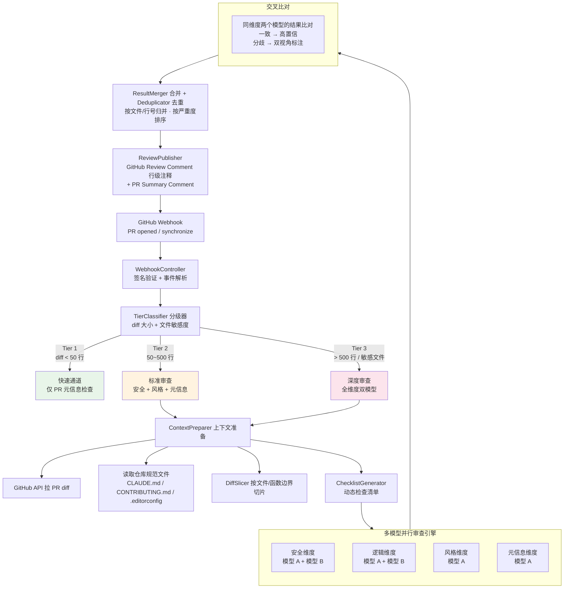

# PRoverlap

多模型交叉审查 GitHub Pull Request —— 分歧即信号，共识即跳过。

[](https://adoptium.net/)
[](https://spring.io/projects/spring-boot)
[](LICENSE)

## 快速开始

```bash
# 1. 克隆
git clone https://github.com/spojchil/proverlap.git
cd proverlap

# 2. 配置环境变量
cp .env.example .env
# 编辑 .env：填入 GitHub App 凭证 + 模型 A / 模型 B 的 API Key

# 3. 一键启动
docker compose up -d
```

## 核心特性

- **双模型交叉审查** — 两个不同模型独立审查同一段代码，交叉比对输出置信度
- **三级分级策略** — 根据 diff 大小和文件敏感度自动选择审查深度（Tier 1/2/3）
- **四维度覆盖** — 安全、逻辑正确性、风格规范、PR 元信息
- **行级 Review Comment** — 发现直接贴到 PR 对应文件和行号上
- **仓库规范感知** — 自动读取 CLAUDE.md / CONTRIBUTING.md / .editorconfig，生成项目专属检查清单

## 架构



## 技术栈

Java 21 · Spring Boot 4.0.6 · LangChain4j 1.15 · PostgreSQL 16 · Redis · Docker Compose

## 项目结构

```
├── proverlap-server/         # 主服务模块
├── docs/
│   ├── project-design.md    # 完整设计文档（Mermaid 图 + 详设）
│   └── decisions.md         # 架构决策记录
├── .github/                 # CI + PR 模板
├── docker-compose.yml       # 一键启动
├── pom.xml
└── README.md
```

## 文档

| 文档 | 说明 |
|------|------|
| [贡献指南](CONTRIBUTING.md) | 分支策略、Commit 规范、PR 流程 |
| [项目设计](docs/project-design.md) | 完整设计文档：架构图、时序图、组件详设、数据模型、API |
| [架构决策](docs/decisions.md) | 关键选型理由与演化记录 |

## 许可证

[MIT License](LICENSE)
