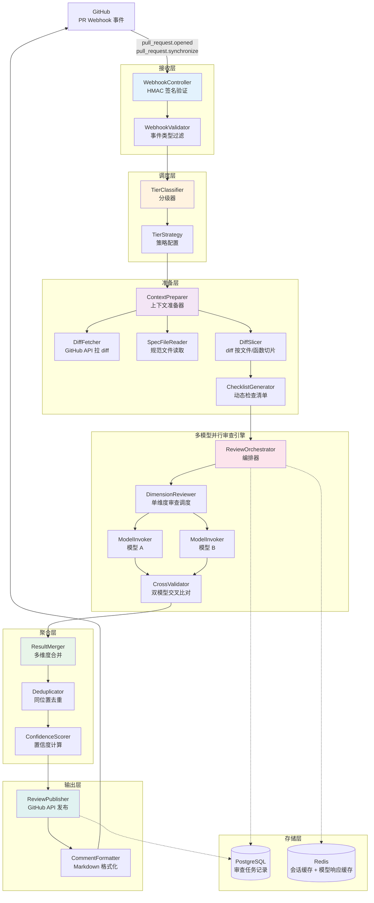
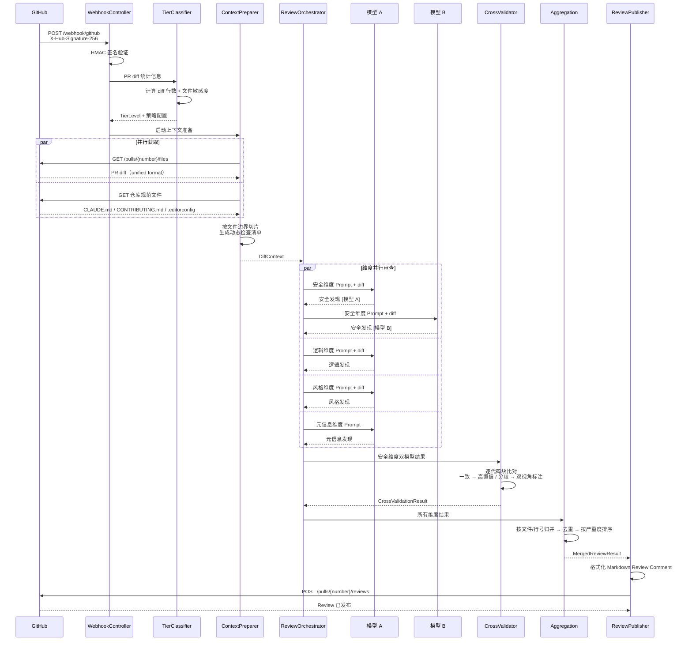
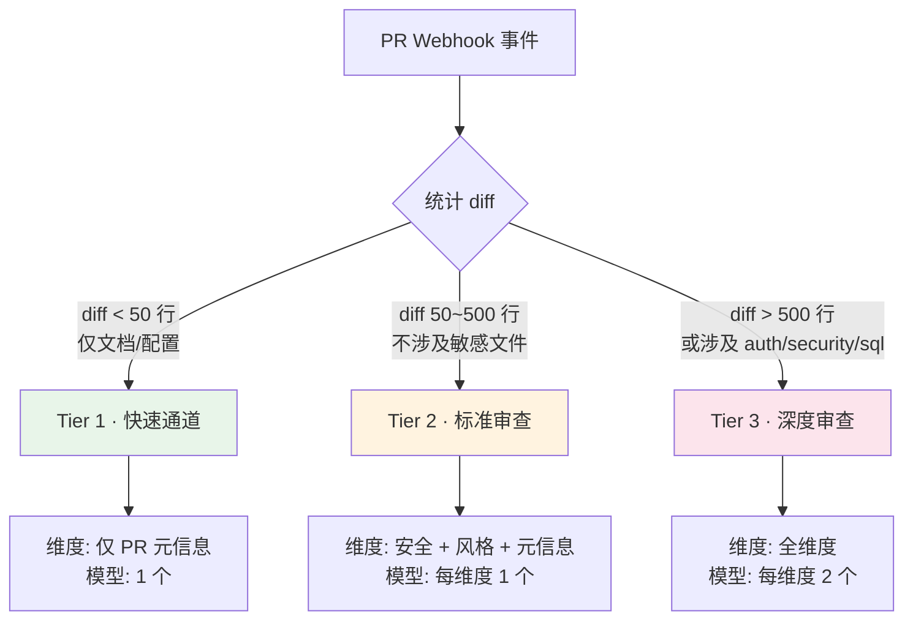
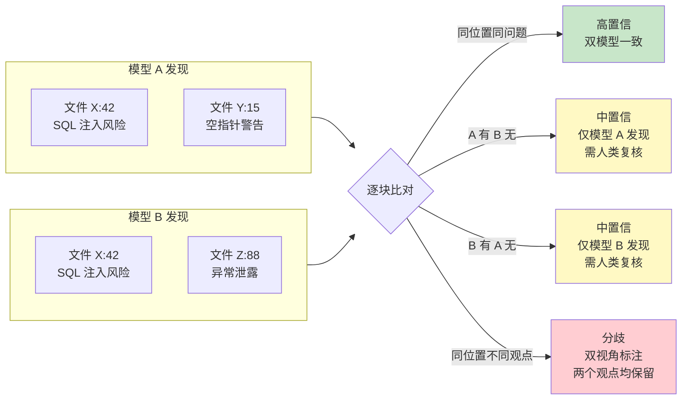
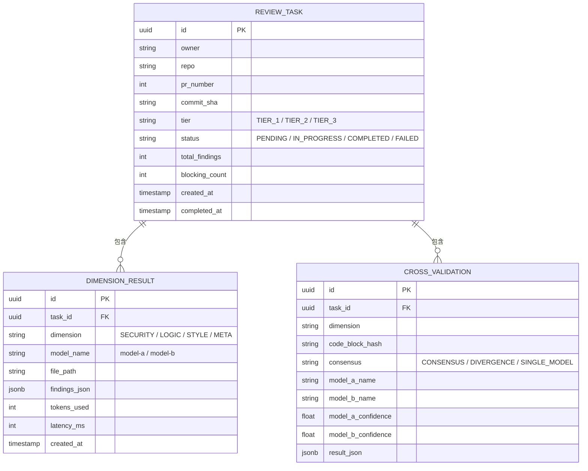
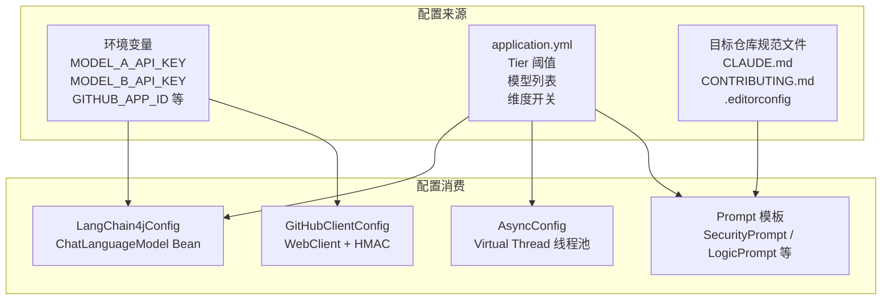

# PRoverlap — 项目设计文档

## 一、项目定义

### 一句话

多模型交叉审查 GitHub Pull Request，分歧即信号，共识即跳过。

### 核心差异

现有方案都是一个模型做审查（Claude Code `code-review`、Night Market `pensive` 等）。它们把审查拆成多个维度，但每个维度只有一个视角。

PRoverlap 的方案：**每个维度至少两个不同模型独立审查同一段代码**。两个模型对同一块代码达成共识 → 高置信度。两个模型意见不一致 → 分歧本身比一致更有价值，两个视角都保留。

### 不做什么

| 不做 | 原因 |
|------|------|
| 单模型 diff 审查 | 与现有方案无差异 |
| PR 描述/总结生成 | 任何 LLM + Prompt 即可，差异化太低 |
| Lint / 格式化检查 | 已有工具链（ESLint、Checkstyle、Prettier 等）完胜 LLM |
| 仓库级别代码审计 | 现有方案已覆盖 |

### 项目定位

一个**开源 GitHub App**。安装到任何 GitHub 仓库后自动对 PR 进行多模型交叉审查，输出标注置信度和分歧点的 Review Comment。

---

## 二、技术选型

| 类别 | 选型 | 理由 |
|------|------|------|
| 语言 | **Java 21** | Virtual Thread 原生支持，适合 I/O 密集型（多 LLM API 并发调用） |
| 框架 | **Spring Boot 4.x** | Webhook 接口 + 依赖注入 + 配置管理 |
| LLM 集成 | **LangChain4j 1.15** | OpenAI 兼容接口，一套代码对接多个模型提供商 |
| 异步编排 | **CompletableFuture + 自定义编排层** | 多模型并行调用 + 超时控制 + 结果汇聚 |
| GitHub 集成 | **GitHub REST API**（自建轻量客户端） | Webhook 接收事件、拉 PR diff、发布 Review Comment |
| 数据库 | **PostgreSQL 16** + **MyBatis-Plus 3.5** | 审查记录、共识缓存，MyBatis-Plus 提供零 SQL 的内置 CRUD |
| 缓存 | **Redis** | 会话状态、临时审查结果、模型响应缓存 |
| 部署 | **Docker Compose** | Java 服务 + PostgreSQL + Redis 一键启动 |

### 模型设计（可插拔）

模型不写死。系统定义两个**模型插槽**，通过环境变量注入具体提供商：

| 角色 | 用途 | 示例填充 |
|------|------|------|
| 模型 A | 主审查，负责代码逻辑、安全、架构维度 | DeepSeek / 智谱 / Qwen |
| 模型 B | 交叉验证，安全维度双模型比对 | Claude / GPT / Gemini |
| 备选 | A/B 不可用时的降级通道 | 任意兼容 OpenAI 接口的模型 |

---

## 三、系统架构

### 整体流程



### 核心链路



### 包结构

```
io.github.spojchil.proverlap/
├── PrReviewApplication.java          # 启动类
├── webhook/
│   ├── WebhookController.java        # Webhook 接收端点
│   └── WebhookValidator.java         # HMAC 签名验证
├── tier/
│   ├── TierClassifier.java           # Tier 分级器
│   └── TierStrategy.java             # 分级策略配置
├── context/
│   ├── DiffFetcher.java              # GitHub API 拉 diff
│   ├── SpecFileReader.java           # 读项目规范文件
│   ├── DiffSlicer.java               # diff 分块
│   └── ChecklistGenerator.java       # 动态检查清单生成
├── review/
│   ├── ReviewOrchestrator.java       # 审查编排器
│   ├── DimensionReviewer.java        # 单维度审查（调度 1-2 模型）
│   ├── ModelInvoker.java             # LLM 调用封装
│   ├── prompts/
│   │   ├── SecurityPrompt.java       # 安全维度 Prompt
│   │   ├── LogicPrompt.java          # 逻辑正确性 Prompt
│   │   ├── StylePrompt.java          # 代码风格 Prompt
│   │   └── MetaPrompt.java           # PR 元信息 Prompt
│   └── CrossValidator.java           # 双模型交叉比对
├── aggregation/
│   ├── ResultMerger.java             # 多维度结果合并
│   ├── Deduplicator.java             # 去重
│   └── ConfidenceScorer.java         # 置信度计算
├── output/
│   ├── ReviewPublisher.java          # 发布 Review Comment
│   └── CommentFormatter.java         # 格式化输出
├── model/
│   ├── entity/                       # MyBatis-Plus 实体（继承 BaseEntity）
│   ├── dto/                          # 数据传输对象
│   └── enums/                        # 枚举（Tier、Severity、Status）
├── mapper/                           # MyBatis-Plus Mapper 接口
└── config/
    ├── LangChain4jConfig.java        # LLM 配置
    ├── GitHubClientConfig.java       # GitHub API 客户端
    ├── MybatisPlusConfig.java        # MyBatis-Plus 拦截器
    └── AsyncConfig.java              # 线程池配置
```

---

## 四、核心组件详设

### 4.1 Tier 分级器

```
输入：PR diff 统计 + 变更文件清单
输出：TierLevel (1/2/3) + 策略配置

判断逻辑：

Tier 1 — 快速通道：
  - diff < 50 行
  - 仅文档（*.md）或注释或配置文件
  - → 仅 PR 元信息检查（Commit 格式 + PR 标题 + 变更范围合理性）
  - → 1 个模型、秒级返回

Tier 2 — 标准审查：
  - diff 50-500 行
  - 不涉及 auth/security/sql 相关文件
  - → 安全 + 代码风格 + PR 元信息，每维度 1 个模型
  - → 并行执行

Tier 3 — 深度审查：
  - diff > 500 行，或
  - 涉及 auth/security/sql/migration 文件
  - → 全维度，每维度 2 个不同模型
  - → 并行执行
```



### 4.2 上下文准备器

**步骤 1：拉取 PR diff**

```
GitHub API: GET /repos/{owner}/{repo}/pulls/{number}
  → 获取 PR 基本信息（标题、描述、分支、变更文件列表）

GitHub API: GET /repos/{owner}/{repo}/pulls/{number}/files
  → 每个文件的 patch（unified diff 格式）
```

**步骤 2：读取项目规范文件**

```
从仓库默认分支读取：
  1. CLAUDE.md / AGENTS.md    → AI 协作约定、项目结构
  2. CONTRIBUTING.md           → Commit 规范、PR 流程、代码风格约定
  3. .editorconfig             → 缩进、字符集
  4. 构建配置（pom.xml / build.gradle / package.json）
  5. lint 配置文件（checkstyle.xml / .eslintrc / ruff.toml）

如果文件不存在 → 跳过该项，不报错
```

**步骤 3：diff 切片**

```
按文件边界切分 → 每个文件独立为一个审查单元
若单文件 > 500 行 diff → 按函数/方法边界二次切片
每个切片标注：文件路径、行号范围、变更类型（新增/修改/删除）
```

**步骤 4：生成动态检查清单**

从规范文件中提取检查项：

```
读取 CONTRIBUTING.md → 提取 Commit 格式要求（type/scope/subject 格式）
读取 CLAUDE.md → 提取技术栈信息（确定审查规则，如 Java → 检查 N+1）
读取 .editorconfig → 提取缩进、换行符规则
从安全知识库注入通用规则 → OWASP Top 10、SQL 注入、XSS 等

输出：本次审查的维度 × 检查项矩阵
```

### 4.3 多 Agent 并行审查引擎

```java
// 伪代码
public ReviewResult executeReview(TierStrategy strategy, DiffContext ctx) {
    List<CompletableFuture<DimensionResult>> futures = new ArrayList<>();

    for (Dimension dimension : strategy.getDimensions()) {
        // 每个维度启动 1-2 个模型
        List<CompletableFuture<SingleModelResult>> modelFutures =
            dimension.getModels().stream()
                .map(model -> CompletableFuture.supplyAsync(
                    () -> modelInvoker.invoke(model, dimension, ctx),
                    executor
                ))
                .toList();

        // 维度结果 = 单模型或多模型的交叉比对
        futures.add(
            CompletableFuture.allOf(modelFutures.toArray(new CF[0]))
                .thenApply(v -> crossValidator.compare(modelFutures, dimension))
        );
    }

    // 等待所有维度完成
    CompletableFuture.allOf(futures.toArray(new CF[0])).join();
    return resultMerger.merge(futures);
}
```

**单模型调用**：

```
输入: 模型标识 + 维度 Prompt（System + User） + diff 切片
输出: 结构化 JSON
  {
    "findings": [
      {
        "file": "src/auth/LoginService.java",
        "line": 42,
        "severity": "WARNING",
        "category": "security",
        "title": "密码明文日志",
        "description": "...",
        "suggestion": "...",
        "confidence": 0.85
      }
    ],
    "summary": "本文件发现 2 个安全问题，其中 1 个高危"
  }
```

**交叉比对**（两个模型审查同一段代码后）：

```
对于 diff 中的每个代码块：

1. 两个模型都有发现 → 比对具体发现
   a. 针对同一行/同一问题的发现 → 高置信度（标注两个模型的置信度均值）
   b. 不同位置的发现 → 各自标注来源模型
2. 仅模型 A 有发现 → 中置信度（可能是 A 过度敏感或 B 漏报）
3. 仅模型 B 有发现 → 中置信度
4. 两个模型都没发现 → 该代码块标记为"已验证"，后续同类模式可跳过
```



### 4.4 结果聚合器

```
合并策略：
1. 按文件路径分组
2. 每个文件内按行号排序
3. 同文件同行同类建议去重（保留置信度最高的）
4. 交叉模型发现标记「高置信 - 双模型一致」
5. 单模型发现标记「需人类复核 - 仅 {模型名} 发现」
6. 分歧发现标记「分歧 - {模型A观点} vs {模型B观点}」

输出排序：
  阻断（blocking）→ 安全问题、逻辑错误
  警告（warning）→ 性能隐患、架构耦合
  建议（suggestion）→ 代码风格、命名建议
  提示（info）→ Commit 格式、PR 标题长度
```

### 4.5 输出发布器

按 GitHub Review Comment 格式，将发现逐一贴到对应文件和行号上：

```
POST /repos/{owner}/{repo}/pulls/{number}/reviews
{
  "event": "COMMENT",
  "comments": [
    {
      "path": "src/auth/LoginService.java",
      "line": 42,
      "body": "## 安全警告 [高置信 - 双模型一致]\n\n
              密码字段在 debug 日志中明文输出。\n\n
              **建议**: 对敏感字段做脱敏处理或移除 debug 日志。\n\n
              ---\n*模型 A (0.92) · 模型 B (0.88)*"
    }
  ]
}
```

---

## 五、审查维度详设

### 维度 1：安全

| 检查项 | 触发条件 | 严重度 |
|------|------|:--:|
| SQL 注入（字符串拼接） | Java: `"SELECT" + var` / Python: `f"SELECT {var}"` | 阻断 |
| XSS（未转义的用户输入） | 前端模板中 `innerHTML` / `dangerouslySetInnerHTML` | 阻断 |
| 敏感信息泄露（密钥/Token 硬编码） | 匹配 `api_key = "xxx"` / `password = "xxx"` 模式 | 阻断 |
| 认证/授权绕过 | 新增接口无鉴权注解 | 阻断 |
| 路径遍历 | `../` 模式在文件路径中 | 阻断 |
| 不安全的加密算法 | MD5/SHA1 用于密码、DES/RC4 | 警告 |
| 异常信息泄露 | `e.printStackTrace()` / 异常消息直接返回前端 | 警告 |

Prompt 注入内容：OWASP Top 10 摘要 + 项目自身认证/授权架构（从规范文件提取）+ 目标语言的常见 CWE。

### 维度 2：逻辑正确性

| 检查项 | 严重度 |
|------|:--:|
| 空指针/未定义访问 | 阻断 |
| 数组/集合越界 | 阻断 |
| 异常处理缺失（try-catch 吞异常） | 警告 |
| 并发问题（共享状态无同步） | 警告 |
| 边界条件遗漏（空列表、零值、null） | 警告 |
| 资源泄露（未关闭的连接/流） | 警告 |
| 条件逻辑错误（死分支、永远为 true/false） | 警告 |

### 维度 3：代码风格与规范符合度

**不检查**：缩进、空格、行宽（linter 工具完胜 LLM）。

**检查**：基于项目 CONTRIBUTING.md / CLAUDE.md 中的约定 —— 变量命名风格是否一致、Commit 格式是否符合 Conventional Commits、新代码是否遵循已有分层架构（不跨层调用）。

### 维度 4：PR 元信息

| 检查项 | 依据 |
|------|------|
| PR 标题格式 | 项目 CONTRIBUTING.md 中的格式要求 |
| PR 描述是否包含必要信息 | 项目 PR 模板 |
| Commit message 格式 | Conventional Commits |
| 变更范围是否合理 | 变更文件列表 vs PR 描述 |
| 缺少测试的变更 | 功能代码变更但无对应测试文件变更 |

---

## 六、数据模型



```sql
-- 审查任务
CREATE TABLE review_task (
    id UUID PRIMARY KEY,
    owner VARCHAR(128),          -- GitHub 仓库 owner
    repo VARCHAR(128),           -- 仓库名
    pr_number INTEGER,           -- PR 编号
    commit_sha VARCHAR(40),      -- 触发审查的 commit
    tier VARCHAR(10),            -- TIER_1 / TIER_2 / TIER_3
    status VARCHAR(20),          -- PENDING / IN_PROGRESS / COMPLETED / FAILED
    total_findings INTEGER,      -- 总发现数量
    blocking_count INTEGER,      -- 阻断级别数量
    created_at TIMESTAMP,
    completed_at TIMESTAMP
);

-- 单个模型的审查结果
CREATE TABLE dimension_result (
    id UUID PRIMARY KEY,
    task_id UUID REFERENCES review_task(id),
    dimension VARCHAR(30),       -- SECURITY / LOGIC / STYLE / META
    model_name VARCHAR(50),      -- 模型标识
    file_path VARCHAR(512),      -- 审查的文件
    findings_json JSONB,         -- 结构化发现列表
    tokens_used INTEGER,
    latency_ms INTEGER,
    created_at TIMESTAMP
);

-- 交叉比对结果
CREATE TABLE cross_validation (
    id UUID PRIMARY KEY,
    task_id UUID REFERENCES review_task(id),
    dimension VARCHAR(30),
    code_block_hash VARCHAR(64),  -- diff 块的 hash
    consensus VARCHAR(20),        -- CONSENSUS / DIVERGENCE / SINGLE_MODEL
    model_a_name VARCHAR(50),
    model_b_name VARCHAR(50),
    model_a_confidence DECIMAL(3,2),
    model_b_confidence DECIMAL(3,2),
    result_json JSONB
);
```

---

## 七、API 设计

### Webhook 接收

```
POST /webhook/github
Headers: X-Hub-Signature-256: sha256=xxx
         X-GitHub-Event: pull_request

处理事件类型:
  - pull_request.opened       → 触发完整审查
  - pull_request.synchronize  → 新 commit push，重新审查
  - pull_request.reopened     → 重新审查
```

### 管理接口

```
GET  /api/reviews/{owner}/{repo}/{pr}         → 查询审查状态
GET  /api/reviews/{owner}/{repo}/{pr}/results → 获取审查结果
POST /api/reviews/{owner}/{repo}/{pr}/retry   → 手动重新触发审查
```

---

## 八、配置体系



```yaml
proverlap:
  # Tier 阈值
  tier:
    t1-max-diff-lines: 50
    t2-max-diff-lines: 500

  # 模型配置（可插拔，通过环境变量注入）
  models:
    model-a:
      base-url: ${MODEL_A_BASE_URL}
      api-key: ${MODEL_A_API_KEY}
      model-name: ${MODEL_A_MODEL}
    model-b:
      base-url: ${MODEL_B_BASE_URL}
      api-key: ${MODEL_B_API_KEY}
      model-name: ${MODEL_B_MODEL}

  # 维度开关（可扩展）
  dimensions:
    security:
      enabled: true
      models: [model-a, model-b]
    logic:
      enabled: true
      models: [model-a, model-b]
    style:
      enabled: true
      models: [model-a]
    meta:
      enabled: true
      models: [model-a]

  # GitHub App
  github:
    app-id: ${GITHUB_APP_ID}
    private-key: ${GITHUB_PRIVATE_KEY}
    webhook-secret: ${GITHUB_WEBHOOK_SECRET}
```

维度可插拔：加新维度只需在 `dimensions:` 下新增一条，写对应的 Prompt 模板，不修改任何 Java 代码。

---

## 九、自举

PRoverlap 仓库本身用它将来的审查标准来维护。项目完成后，**用它自己来审查自己的 PR** —— 这既是质量保障，也是最好的功能演示。

---

## 十、扩展路线

| 优先级 | 功能 | 说明 |
|:--:|------|------|
| P1 | Agent 间讨论 | 两个模型发现分歧 → 启动"讨论轮"让 LLM 评审双方结论 |
| P1 | 共识缓存 | 已验证的同类型代码块缓存，后续单模型快速验证 |
| P2 | 增量审查 | 只审查新增 commit，复用已审查代码块的缓存结论 |
| P2 | 语言感知 | 自动识别 PR 语言，注入对应 best practice |
| P2 | GitLab / Gitee 支持 | 抽象 Git 平台接口层 |
| P3 | Web 管理面板 | 审查历史、统计仪表盘 |
| P3 | 自定义规则 | 仓库根目录的 `.proverlap.yml` 覆盖默认检查项 |
| P3 | 模型性能对比 | 长期追踪各模型在同一维度上的准确率/误报率 |
